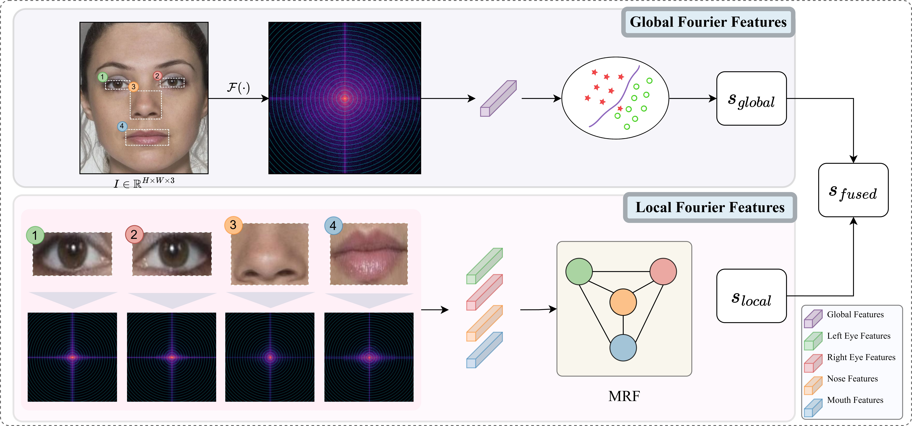

# FD-MAD: Frequency-Domain Residual Analysis for Face Morphing Attack Detection

This repository contains the official implementation of the paper ["FD-MAD: Frequency-Domain Residual Analysis for Face Morphing Attack Detection"](https://arxiv.org/abs/2601.20656), accepted at IEEE FG2026.

---

## Overview

Face morphing attacks can fool biometric systems by blending two identities into a single realistic face. Detecting these attacks from a **single image (S-MAD)** is particularly challenging.

**FD-MAD** tackles this problem by analyzing images in the **frequency domain**, where morphing artifacts are more visible than in pixel space.

Instead of relying on heavy deep learning models, FD-MAD uses a **lightweight and interpretable pipeline** that combines:

* Global frequency patterns
* Local facial region analysis
* Structured inference (MRF-based)

This makes FD-MAD particularly effective in **cross-dataset scenarios**, where many deep learning approaches struggle.

---

## Method



<p align="center"><em>Overview of FD-MAD.</em></p>

### Key idea

Natural images follow consistent frequency patterns. Morphing disrupts these patterns—especially in **mid and high frequencies**.

FD-MAD highlights these inconsistencies by removing natural frequency trends and extracting **residual frequency features**, then combines evidence across facial regions.

---

## Key Features

* **Frequency-domain analysis** (more robust to unseen attacks)
* **Global + local features** (full face + eyes, nose, mouth)
* **MRF-based fusion** for spatial consistency
* **Lightweight pipeline** (SVM + Logistic Regression)
* Strong **cross-dataset generalization**

---

## Pipeline

1. Extract **frequency residual features** (global + local)
2. Train **global classifier** (SVM)
3. Compute **region-wise predictions**
4. Apply **MRF** for structured consistency
5. Fuse scores → final decision

---

## Installation

```bash
conda create -n fdmad python=3.10
conda activate fdmad
pip install -r requirements.txt
```

---

## Dataset Structure

```
<dataset_root>/
├── aligned/
├── regions/
│   ├── mouth/
│   ├── nose/
│   ├── left_eye/
│   └── right_eye/
└── labels_*.csv
```

---

## Usage

### 1. Feature Extraction

```bash
python fd_mad_features.py extract \
  --train-root-global path/to/train/aligned \
  --train-root-local path/to/train/regions \
  --train-csv train.csv \
  --test-root-global path/to/test/aligned \
  --test-root-local path/to/test/regions \
  --test opencv=labels_opencv.csv facemorph=labels_facemorph.csv webmorph=labels_webmorph.csv mipgan_1=labels_mipgan_1.csv mipgan_2=labels_mipgan_2.csv mordiff=labels_mordiff.csv \
  --features-out features_residual \
  --do-global \
  --do-local \
  --regions mouth nose left_eye right_eye
```

This will generate the following structure:
```
features_residual/
  global/
    train.npz
    test_opencv.npz
    ...
  local/
    mouth/
    nose/
    left_eye/
    right_eye/
```

### 2. Train Global Model

```bash
python fd_mad_features.py train-eval \
  --features-out features_residual \
  --model-out models/global_residual \
  --test-names opencv facemorph webmorph mipgan_1 mipgan_2 mordiff
```

### 3. Local Modeling (MRF)

```bash
python fd_mad_mrf.py \
  --features-out features_residual \
  --regions mouth nose left_eye right_eye \
  --tests opencv facemorph webmorph mipgan_1 mipgan_2 mordiff \
  --graph fc \
  --beta 0.9 \
  --save-dir saved_mrf_local
```

### 4. Score Fusion

```bash
python fd_mad_fuse_scores.py \
  --features-out features_residual \
  --tests opencv facemorph webmorph mipgan_1 mipgan_2 mordiff \
  --global-model-dir models/global_residual \
  --local-model-dir saved_mrf_local \
  --alpha 0.6
```

---

## Results

* Trained on: **SMDD**
* Evaluated on: **FRLL-Morph**, **MAD22**, **MorDIFF**


* **FRLL-Morph**: 1.85% EER
* **MAD22**: 6.12% EER (2nd place)

Robust across:

* Landmark-based morphs
* GAN-based morphs
* Diffusion-based morphs

---

## 📌 Citation

```bibtex
@misc{paulo2026fdmad,
  title         = {FD-MAD: Frequency-Domain Residual Analysis for Face Morphing Attack Detection},
  author        = {Diogo J. Paulo and Hugo Proen\c{c}a and Jo\~ao C. Neves},
  year          = {2026},
  eprint        = {2601.20656},
  archivePrefix = {arXiv},
  primaryClass  = {cs.CV},
  doi           = {10.48550/arXiv.2601.20656}
}
```
